# SWMM Surrogate Modeling — Detailed Walkthrough & Decision Log

This document is a **narrative + decision log** for the whole project. For every phase it records:

- **What we did** and **why**, with the actual code, outputs, and figures.
- **Every decision point** — the options that were on the table, which one we chose, the reasoning, and **what the alternatives would have changed**.

The goal is that later you (or a collaborator) can see not just the path taken but the *forks* — so you can revisit a junction and take a different branch deliberately. Jump to the [Master Decision Map](#master-decision-map) for the one-screen summary.

> **How the project was built.** Each phase was a `design → build → run → review` cycle: we brainstormed the design and chose between options *before* writing code, wrote a spec (`docs/superpowers/specs/*.md`), generated the notebook from a builder script (`scripts/build_phaseN.py` using `nbformat`), executed it, and reviewed the results before committing. The builder-script pattern means every notebook is regenerable and diffable.

---

## Table of contents

1. [Project goal](#0-project-goal)
2. [Repository map](#repository-map)
3. [Phase 1 — Base SWMM model](#phase-1--base-swmm-model)
4. [Phase 2 — LHS sampling + SWMM automation](#phase-2--lhs-sampling--swmm-automation)
5. [Phase 3 — Surrogate training](#phase-3--surrogate-training)
6. [Phase 4 — Monte Carlo + sensitivity](#phase-4--monte-carlo--sensitivity)
7. [Phase 5 — Applicability domain](#phase-5--applicability-domain)
8. [Phase 6 — AD-guided adaptive sampling](#phase-6--ad-guided-adaptive-sampling)
9. [Cross-cutting decisions](#cross-cutting-decisions)
10. [Master Decision Map](#master-decision-map)
11. [Reproduce everything](#reproduce-everything)

---

## 0. Project goal

**Research question:** *Can a machine-learning surrogate reproduce important EPA SWMM outputs accurately enough to replace SWMM in large Monte Carlo flood-risk uncertainty analysis — and can we know when to trust it?*

The pipeline:

```
SWMM model → LHS sampling → automated batch runs → dataset
           → ML surrogate → Monte Carlo → sensitivity + applicability domain
```

The last clause ("know when to trust it") became the project's distinctive thread: Phases 5–6 add an **applicability domain (AD)** layer, mirroring applicability-domain reasoning from landslide-susceptibility ML.

---

## Repository map

```
surrogate_modeling/
├── README.md, PROJECT_BRIEF.md, requirements.txt, .gitignore
├── swmm/            base_model.inp/.rpt + experiment_pipe.*  (the SWMM model)
├── notebooks/       phase2..phase6 .ipynb  (executed, outputs embedded)
├── scripts/         build_phaseN.py (notebook generators) + swmm_utils.py
├── data/            dataset.csv + all result CSVs
├── docs/            specs/, figures/, base_model_spec.md, this WALKTHROUGH.md
└── runs/            per-scenario SWMM files (gitignored)
```

**Convention:** notebooks are *generated* by `scripts/build_phaseN.py`. To change a notebook, edit its builder and re-run it. `swmm_utils.py` holds the shared SWMM helpers (`write_scenario`, `run_swmm`, `parse_rpt`).

---

## Phase 1 — Base SWMM model

**What:** hand-built a small, understandable drainage model in the EPA SWMM 5.2 GUI, a trimmed version of EPA's `Site_Drainage_Model` sample, then validated it.

**Topology:**
```
S1 ┐
S2 ┼→ J1 → C1 → J2 → C2 → Out1
S3 ┘
```
3 subcatchments → junction J1 → pipe C1 → junction J2 → pipe C2 → outfall, driven by a 2-year, 2-hour design storm.

**Baseline outputs (deterministic run):**
- Peak outfall discharge ≈ **19.93 CFS**
- **Zero flooding**, continuity error **< 0.5 %**
- Pipe **C1 is the bottleneck** (~104 % capacity) — the physical feature that later dominates the sensitivity results.

A manual one-parameter experiment (shrinking C1 from 2.0→1.5 ft) made J1 flood *and* dropped the downstream C2 peak — demonstrating that the bottleneck both causes local flooding and throttles/protects downstream flow. This built intuition for what the surrogate would later have to learn.

### Decisions in Phase 1

| Decision | Chosen | Alternatives / why |
|---|---|---|
| Build vs download a model | **Rebuild a trimmed EPA sample by hand** | A complex real-world model would hide assumptions; building it taught every `.inp` section. |
| Unit system | **US (CFS/ft/in)** | Matched the reference EPA sample; SI would have required reconverting the storm. |
| Infiltration method | **Horton** | Standard for the sample; its fast decay later became a key modeling insight (see Phase 2/3). |

---

## Phase 2 — LHS sampling + SWMM automation

**Goal chosen:** *build the full Python automation and validate it with a 100-run pilot* (the brief's "quick automation test"), before scaling.

> **Decision — session scope.** Options were: (a) **full pipeline + 100-run pilot** ✅, (b) sampling script only, (c) pipeline + full 300–500 set immediately. We picked (a): build everything but prove it on 100 runs first, so bugs surface cheaply before committing to a big batch. *(Later we scaled to 500 — see end of phase.)*

### The five uncertain parameters

> **Decision — how to vary %imperv.** Options: **multiplier on each subcatchment's baseline %imperv** ✅ vs a single absolute value applied to all. We chose the multiplier to preserve the calibrated S1/S2/S3 spatial pattern. Absolute would have been more directly interpretable but erased the heterogeneity.

| # | Feature | `.inp` change | Baseline | Range | Dist. |
|---|---------|---------------|---------|-------|-------|
| X1 | `rain_mult` | multiply the `2-yr` rainfall timeseries | 1.0 | 0.7–1.5 | Uniform |
| X2 | `imperv_mult` | multiply each subcatchment %Imperv (clip 0–100) | 1.0 | 0.7–1.3 | Uniform |
| X3 | `surf_n` | set N-Imperv (overland roughness) | 0.015 | 0.011–0.030 | Uniform |
| X4 | `infil_min` | set Horton **MinRate** (in/hr) | 0.2 | 0.05–1.5 | Uniform |
| X5 | `pipe_n` | set conduit Manning roughness | 0.016 | 0.011–0.030 | Uniform |

**Why `infil_min` (MinRate) and not MaxRate:** Horton decay is 6.5/hr, so infiltration drops from 4.5→~0.37 in/hr within ~30 min — *before* the storm peak. MaxRate barely affects peak runoff; the steady MinRate is the knob that matters over the storm. (Phases 3–4 later confirmed infiltration is nearly irrelevant even so.)

**Targets parsed from each run:** `peak_discharge_cfs`, `total_flood_vol` (10⁶ gal), `num_flooded_nodes`, plus `continuity_error_pct` and a `status` flag for QC.

### How SWMM is run and read

> **Decision — run + extract method.** Options: **`runswmm.exe` CLI + parse the `.rpt` text** ✅ vs `swmm-toolkit` (binary `.out`) vs `pyswmm` (in-process). We chose the CLI + text parse: no new dependency, fully transparent (you can open the `.rpt` and see the numbers). We added a small `pyswmm` demo cell purely to *learn* the in-process API.

The three core helpers (now in `scripts/swmm_utils.py`):

```python
def write_scenario(base_text, params):
    """Walk the .inp line by line, tracking [SECTION]; rewrite just the
    relevant token in each data line; leave comments/blanks untouched."""
    ...
    if section == "[TIMESERIES]" and toks[0] == "2-yr":
        toks[-1] = _fmt(float(toks[-1]) * rain_mult)      # scale rainfall
    elif section == "[SUBCATCHMENTS]":
        toks[4] = _fmt(min(100, max(0, float(toks[4]) * imperv_mult)))  # %Imperv
    elif section == "[SUBAREAS]":     toks[1] = _fmt(surf_n)     # N-Imperv
    elif section == "[INFILTRATION]": toks[2] = _fmt(infil_min)  # Horton MinRate
    elif section == "[CONDUITS]":     toks[4] = _fmt(pipe_n)     # roughness

def run_swmm(inp_path, swmm_exe):
    """subprocess call: runswmm.exe <in.inp> <report.rpt> <out.out>."""
    ...

def parse_rpt(rpt_text):
    """Regex/anchor parse for peak (Outfall Loading 'Max Flow'), flooding loss,
    flooded-node count, and Flow-Routing continuity error."""
```

<div class="explain" markdown="1">
**Reading the code — these three functions are the whole automation engine:**

- **`write_scenario`** takes the base model *as text* plus one parameter set, and returns a modified copy. It walks the file line by line, keeps track of which `[SECTION]` it's inside, and rewrites **only the single number that matters** in each relevant line — the rainfall value, the %imperv, the roughness, the infiltration rate. Everything else (comments, geometry) is copied through untouched.
- **`run_swmm`** hands that scenario file to the SWMM engine as a command-line program and waits for it to finish (produces a `.rpt` report + `.out` binary).
- **`parse_rpt`** reads the text report back and pulls out the four numbers we care about (peak discharge, flood volume, flooded-node count, continuity error).

Together they turn "one parameter set" → "SWMM answers" with no human clicking.
</div>

**A real bug we caught during validation:** the continuity line in the `.rpt` reads `Continuity Error (%)` — and there are *two* (Runoff Quantity + Flow Routing). The first-draft regex `Flow Routing Continuity Error (%)` matched neither. Fixed by anchoring on the "Flow Routing Continuity" block header first. Also handled: the "Node Flooding Summary" table is **absent** when nothing floods → parser returns 0 flooded / 0 volume rather than erroring.

### Sampling + batch loop

```python
from scipy.stats import qmc
sampler = qmc.LatinHypercube(d=5, seed=SEED)
samples = qmc.scale(sampler.random(n=N_RUNS), lows, highs)   # 100 (later 500) × 5
```

<div class="explain" markdown="1">
**Reading the code:**

- **`LatinHypercube(d=5)`** builds a sampler for a 5-dimensional space (our 5 parameters). `sampler.random(n=N_RUNS)` draws that many points, each coordinate between 0 and 1, **evenly spread** — every parameter's range is covered without random clumps or gaps (that's the advantage over `np.random`).
- **`qmc.scale(..., lows, highs)`** stretches each 0–1 column to its real physical range (e.g. `rain_mult` → 0.7–1.5).
- **`seed=SEED`** makes it reproducible — the same 500 scenarios every run.

Output: a `500 × 5` table of parameter combinations to feed SWMM.
</div>

The batch loop is fault-isolated (one bad run flags its row, never crashes the batch) and deletes the binary `.out` after parsing.

### Outputs (100-run pilot)

```
100/100 ok (0 failures), 3.7 s total (~37 ms/run)
peak range 10.8–36.2 CFS (mean 19.55, baseline 19.93) ✓
31/100 runs flooded
```

**Figures** (from the 500-run version):

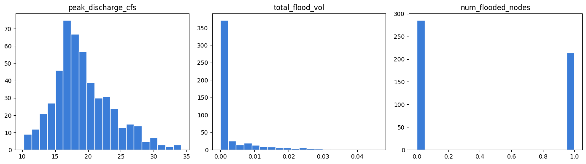
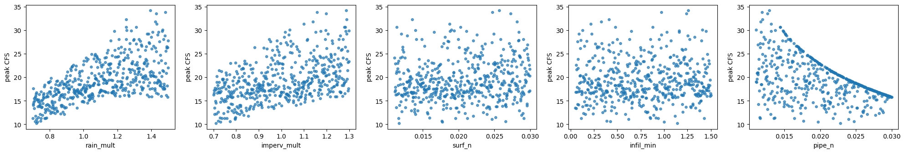

**Scaling to 500.** After the pilot passed, we set `N_RUNS = 500` and re-ran → **500 runs, 176 flooded (35 %), 0 failures**. This 500-row `data/dataset.csv` is the training set for everything downstream.

### Decisions in Phase 2

| Decision | Chosen | Alternatives — what they'd change |
|---|---|---|
| Session scope | full pipeline + 100 pilot | *sampling-only* = smaller step; *straight-to-500* = risk running a buggy pipeline 500×. |
| Run + extract | runswmm.exe + parse `.rpt` | *swmm-toolkit/pyswmm* = cleaner numeric access, in-process speed, but a dependency and less transparent. Worth switching to `pyswmm` if per-run subprocess overhead ever dominates. |
| %imperv variation | per-subcatchment multiplier | *absolute uniform* = simpler feature semantics, loses spatial pattern. |
| Sampling | LHS (`scipy.qmc`) uniform | *plain random* = clumps/gaps; *maximin/Sobol LHS* = better joint coverage if you scale features. |
| Dataset size | 500 | 100 (noisy) / 300 (brief's mid-point) / 1000 (diminishing returns at this smoothness). |

---

## Phase 3 — Surrogate training

**Goal:** train ML surrogates on the 500-run dataset, compare Random Forest vs XGBoost, validate accuracy + speedup.

> **Decision — dataset size.** Options: **scale to 500** ✅ / 300 / keep 100 / full learning-curve sweep. Chose 500: cheap (~20 s) and gives a credible 400/100 split.
>
> **Decision — targets & the zero-inflated flood volume.** Options: **peak regression + 2-stage flood** ✅ / peak + single flood regressor / peak only. ~65–69 % of runs have *zero* flooding, so one regressor would fit neither the zeros nor the extremes. The 2-stage split (classify flood yes/no, then regress volume on flooded cases only) is the honest structure.
>
> **Decision — validation.** 80/20 split **stratified on flood class** + **5-fold CV** (500 is small enough that a single split is noisy).

### The three tasks

```python
y_peak  = df["peak_discharge_cfs"]                 # 1. regression
flooded = (df["total_flood_vol"] > 0).astype(int)  # 2. classification
# 3. regression of total_flood_vol on flooded rows only
idx_train, idx_test = train_test_split(df.index, test_size=0.2,
                                       random_state=SEED, stratify=flooded)
```

<div class="explain" markdown="1">
**Reading the code:**

- **`y_peak`** is the continuous target for task 1. **`flooded`** turns the flood volume into a yes/no (1 if any flooding) — the target for task 2.
- **`train_test_split(..., test_size=0.2)`** holds out 20 % of runs the model never sees during training, so we can measure honest accuracy.
- **`stratify=flooded`** forces both the train and test halves to keep the same flood/no-flood ratio (~35 % flooded). Without it, a random split could leave the small test set with too few floods to evaluate fairly.
</div>

Models: `RandomForestRegressor(n_estimators=300)` vs `XGBRegressor(n_estimators=400, lr=0.05, max_depth=4, subsample=0.9)` (analogous classifiers).

### Results

| Task | Metric | RandomForest | **XGBoost** |
|------|--------|-------------:|------------:|
| Peak discharge | R² / CV-R² | 0.980 / 0.975 | **0.982 / 0.979** |
| Peak discharge | RMSE (CFS) | 0.638 | **0.605** |
| Floods? | F1 / ROC-AUC | 0.939 / 0.996 | **0.955 / 0.995** |
| Floods? | precision / recall | 1.00 / 0.886 | 1.00 / **0.914** |
| Flood volume | R² | 0.861 | **0.916** |

XGBoost won all three. **CV-R² ≈ test-R²** for peak → genuine fit, not overfitting.

- **Extreme-case check** (top-20 % peaks): R² 0.982 → **0.908** — mild degradation, the seed of the AD work.
- **Classifier caveat:** recall 0.914 → missed 3 of 35 real floods (false negatives are the risk-relevant error).
- **Flood-volume** trained on only ~140 flooded rows → noisier (36 test points).

**Speedup:** 10,000 surrogate predictions in **12 ms** vs ~6.2 min of SWMM → **~30,000×**.

**Feature importance (peak):** `rain_mult` 0.91 ≫ `pipe_n` 0.64 > `imperv_mult` 0.41 ≫ `surf_n` ≈ `infil_min` ≈ 0 — physically sensible and confirms the Horton-decay reasoning.

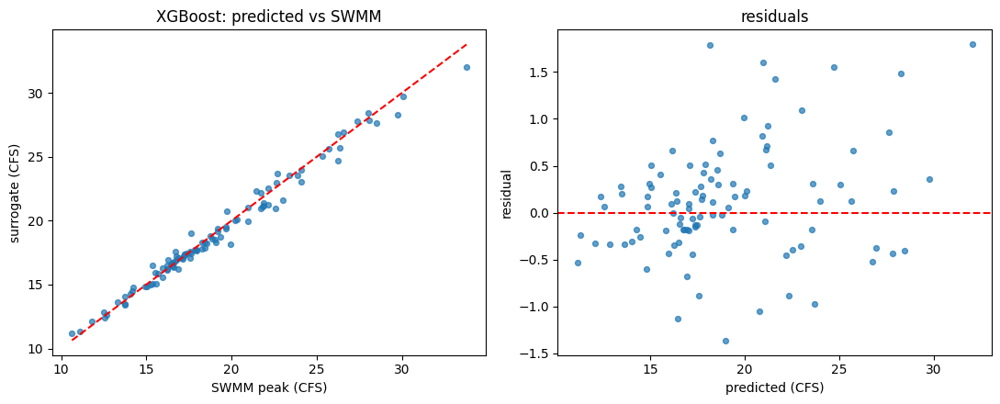
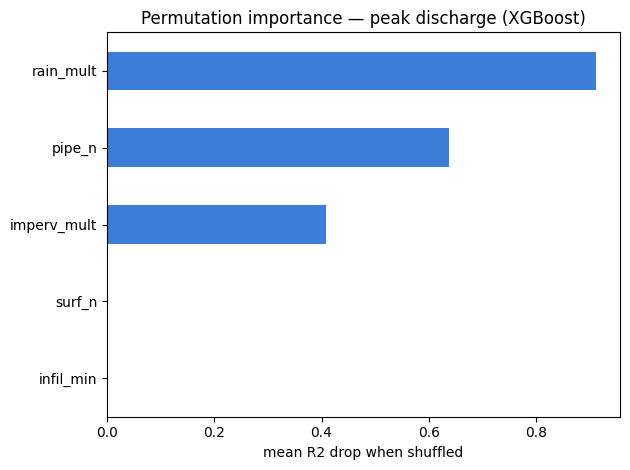

### Sub-decision: hyperparameter tuning

> **Decision — tune or not?** We did a **light pass** (RandomizedSearchCV, 40 candidates, 5-fold CV on XGBoost), explicitly *not* a deep Optuna study. Rationale: peak/classifier were at the physics/data ceiling; only flood-volume had headroom, and its 36-point test set makes any "gain" noise.

**Result:** *no* task improved on CV (CV gain ≤ 0 everywhere) — the defaults were already near-optimal. Defaults retained. The one tempting number (flood-volume test R² 0.916→0.944) was **not** supported by CV → correctly rejected as noise. This produced the defensible sentence: *"a 40-candidate randomized search yielded no improvement over defaults."*

### Decisions in Phase 3

| Decision | Chosen | Alternatives — what they'd change |
|---|---|---|
| Data size | 500 | 300 = lighter; learning-curve = answers "how many runs enough?" but many retrains. |
| Flood target | 2-stage (classify → regress) | single regressor = simpler, worse on zeros; peak-only = defer flooding. |
| Validation | 80/20 stratified + 5-fold CV | plain split = noisier; nested CV = unbiased tuning but heavier. |
| Models | RF vs XGBoost | + Neural net / Gaussian process (brief lists these); GP gives built-in uncertainty (relevant to AD). |
| Tuning | light RandomizedSearch | deep Optuna = overkill here; skip = slightly less defensible. |

---

## Phase 4 — Monte Carlo + sensitivity

**Goal:** push 50,000 uncertain scenarios through the surrogates for probabilistic flood risk, then run global sensitivity.

> **Decision — MC input distributions.** Options: **uniform over the training ranges** ✅ / physically-motivated per-param distributions / deliberately wider than training. Chose uniform-in-range: every MC point is inside the surrogate's learned domain (trustworthy by construction) and a clean baseline for the AD phase. *"Wider than training" was deliberately deferred — it only makes sense once the AD check exists.*
>
> **Decision — combine the 2-stage flood.** Options: **hard two-stage** ✅ (classifier decides flood; if yes, volume; else 0) / probabilistic Bernoulli(p) / probability-weighted expected value. Hard two-stage gives a clean per-sample outcome → real exceedance curves.
>
> **Decision — sensitivity methods.** Options: **permutation + SHAP** ✅ / + Sobol (SALib) / permutation only. Permutation + SHAP matches the brief and the interpretability angle; Sobol deferred.

```python
Xmc  = rng.uniform(lows, highs, size=(50_000, 5))
peak  = peak_reg.predict(Xmc)
flood = flood_clf.predict(Xmc)                          # hard 0/1
vol   = np.where(flood == 1, vol_reg.predict(Xmc), 0.0) # two-stage
```

<div class="explain" markdown="1">
**Reading the code:**

- **`rng.uniform(lows, highs, size=(50_000, 5))`** invents 50,000 fresh "what-if" scenarios, each a random draw of the 5 parameters within the training ranges.
- **`peak_reg.predict`** — the surrogate instantly estimates peak discharge for all 50,000 (this is the ~30,000× speedup vs running SWMM).
- **`flood_clf.predict`** — the classifier decides flood (1) or not (0) for each.
- **`np.where(flood == 1, vol_reg.predict(...), 0.0)`** is the **two-stage rule**: predict a flood *volume* only where the classifier said "flood," otherwise the volume is exactly 0. This avoids forcing one model to explain the huge spike of zeros.
</div>

### Probabilistic results

**Sanity check passed:** P(flood) = **33.0 %** (≈ 35 % training rate); mean peak **19.07 CFS** (≈ 19.9 baseline) — MC wired correctly.

| Peak discharge | | Flood volume (flooded) | |
|---|---|---|---|
| P90 | 25.1 CFS | P95 | 29,137 gal |
| P95 | 27.2 CFS | P99 | 37,919 gal |
| P99 | 30.8 CFS | | |

Headline exceedance statements: **P(peak > 25 CFS) = 10.2 %**, P(peak > 30) = 1.6 %, **P(flood_vol > 10,000 gal) = 12.6 %**.

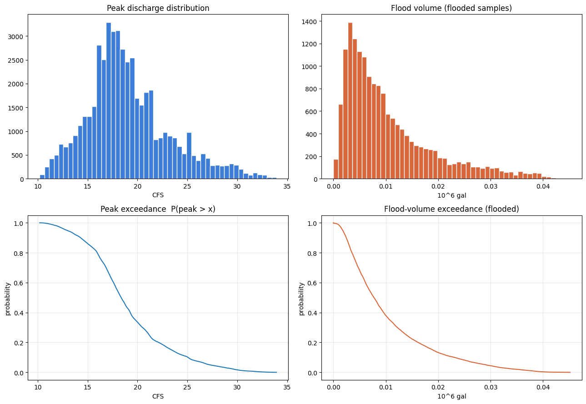

### Sensitivity — three distinct physical stories

Permutation importance (rank within each column; scales differ across targets):

| Feature | Peak | Floods? | Flood volume |
|---------|-----:|--------:|-------------:|
| rain_mult | **0.93** | 0.18 | **1.41** |
| imperv_mult | 0.51 | 0.12 | **1.15** |
| pipe_n | 0.74 | **0.20** | 0.98 |
| surf_n | ~0 | ~0 | ~0 |
| infil_min | ~0 | ~0 | ~0 |

- **Whether it floods** → *pipe roughness* leads (the C1 bottleneck decides overflow).
- **Peak discharge** → rainfall, then conveyance, then imperviousness.
- **Flood volume** → rainfall, then **imperviousness jumps to #2**.
- **Honest surprise:** `infil_min` stays ~0 *even for flood volume* — in flood-causing storms, steady infiltration is a tiny fraction of total rainfall. Both `surf_n` and `infil_min` are negligible everywhere → candidates to drop.

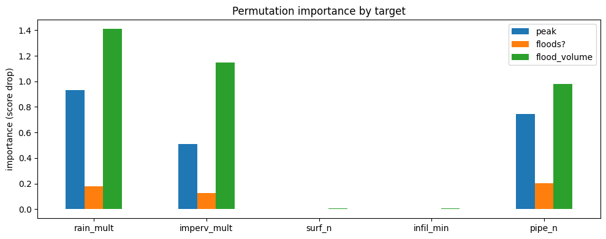

SHAP beeswarms confirm directions (red = high feature value):

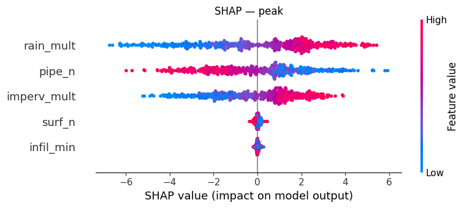
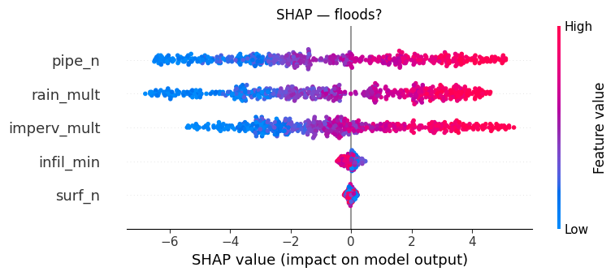
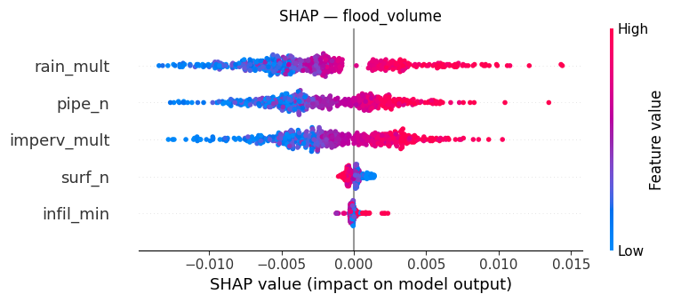

### Decisions in Phase 4

| Decision | Chosen | Alternatives — what they'd change |
|---|---|---|
| MC inputs | uniform over training ranges | *realistic distributions* = a real-world probabilistic story (needs justifying 5 priors); *wider* = stress the AD (that's Phase 5). |
| Flood combine | hard two-stage | *Bernoulli(p)* = propagates classifier uncertainty; *prob-weighted* = smooth expectations, no distribution. |
| Sensitivity | permutation + SHAP | *+Sobol* = variance-based gold standard (cheap here — good future add); *perm-only* = no direction. |
| MC size | 50,000 | 10k (faster) / 100k (trivially cheap — tighter tails). |

---

## Phase 5 — Applicability domain

**Goal:** define an applicability domain (AD) and **validate the core hypothesis — distance from training predicts surrogate error** — with real SWMM ground truth.

> **Decision — phase scope.** Options: **define AD + validate the error link** ✅ / AD scoring only / full incl. adaptive sampling. Chose the middle: a self-contained, publishable result; adaptive sampling became Phase 6.
>
> **Decision — probe design.** Options: **wide uniform box** ✅ / radial shells / held-out+extrapolated mix. Wide box (50 % wider each side, clipped) naturally spans inside→outside → a smooth spread of distances to correlate against error.

### The three AD definitions (fit on the 500 training scenarios)

```python
# Range (baseline): inside training min–max box
# Mahalanobis (raw features; scale-invariant, uses correlations):
D = np.asarray(X) - mu
maha = np.sqrt(np.einsum("ij,jk,ik->i", D, Sigma_inv, D))
# kNN (standardized): mean distance to 10 nearest training points
```

<div class="explain" markdown="1">
**Reading the code — two ways to measure "how far is this point from what the model was trained on":**

- **Mahalanobis distance** (the `einsum` line) measures distance from the training *centre*, but scaled by the spread and correlations of the training data — so it's in units of "standard deviations, accounting for how the parameters move together." Big value = an unusual combination. It's scale-invariant, so it doesn't matter that `rain_mult`≈1 and `surf_n`≈0.02.
- **kNN distance** takes each point and averages the distance to its 10 nearest training scenarios (after standardizing so every feature counts equally). Big value = the point sits in a *sparse* region the training set barely covered.
- **Thresholds** are set at the 99th percentile of the training points' own distances — i.e., "if a new point is farther than 99 % of the training data, flag it as out-of-domain."
</div>

Thresholds = 99th percentile of the training distribution (Mahalanobis **3.18**, kNN **1.32**).

### AD coverage of the 50k Monte Carlo

| Metric | Coverage |
|--------|---------:|
| Range | 99.4 % |
| Mahalanobis | 98.8 % |
| **kNN** | **92.3 %** |

The teaching contrast: range says ~100 %, but kNN flags ~8 % of "in-range" MC as unusual corner combinations → **range-based AD is too weak.**

### The core experiment

```python
# 300 probes over a box 1.5× wider → run REAL SWMM → compare to surrogate
probes["abs_err"]     = (probes["swmm_peak"] - peak_reg.predict(X)).abs()
probes["mahalanobis"] = maha(X); probes["knn_dist"] = knn(X)
```

<div class="explain" markdown="1">
**Reading the code:**

- **`swmm_peak`** is the *ground truth* — the real SWMM answer for each probe point.
- **`abs_err`** is how far the surrogate's guess is from that truth (the thing we want to predict).
- **`mahalanobis` / `knn_dist`** tag each probe with how far it sits from the training domain.

With all three columns per probe, the next step just asks: *does `abs_err` rise as the distance columns rise?* (It does — Spearman ρ ≈ 0.52–0.55.)
</div>

**Result — hypothesis confirmed (300 probes, 261 out-of-range):**
- Spearman ρ: **Mahalanobis 0.522**, **kNN 0.551** (p ≈ 10⁻²²).
- Monotonic error gradient by distance quintile:

| Quintile (1=near … 5=far) | 1 | 2 | 3 | 4 | 5 |
|---|---|---|---|---|---|
| mean \|error\| (CFS) | 0.49 | 1.12 | 1.36 | 2.02 | **2.80** |

- In-range error **0.36** vs out-of-range **1.74 CFS** (~5×).
- **AD as a trust filter:** in-AD 0.80 vs out-of-AD 2.08 → out-of-AD predictions ~**2.6× worse**.

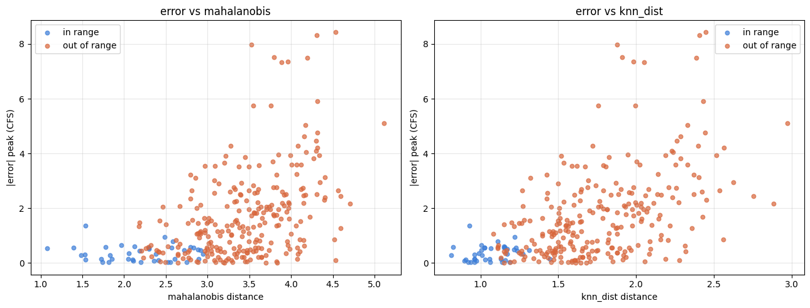

### Decisions in Phase 5

| Decision | Chosen | Alternatives — what they'd change |
|---|---|---|
| Scope | AD + validate error link | *AD-only* = diagnostic, not validated; *+adaptive* = one huge phase. |
| Probe design | wide uniform box | *radial shells* = controlled distance bins; *mix* = reuses data but muddies comparison. |
| AD metrics | range + Mahalanobis + kNN | *isolation forest / LOF / autoencoder* = flexible ML-based ADs; *GP variance* if you'd used a GP surrogate. |
| Error target | peak discharge | flood volume (messier, only defined when flooded). |

---

## Phase 6 — AD-guided adaptive sampling

**Goal:** use the AD to choose *where to run more SWMM*, retrain, and prove AD-guidance beats plain "more data."

> **Decision — selection signal.** Options: **AD-distance space-filling (maximin)** ✅ / model uncertainty (RF variance) / hybrid. Chose maximin: directly on-theme with the distance→error finding, deterministic, and RF variance is unreliable outside the training domain (trees extrapolate flat).
>
> **Decision — evaluation.** Options: **adaptive vs random on a fixed held-out test set** ✅ / adaptive-only before/after / full learning-curve sweep. The controlled adaptive-vs-random comparison is what isolates the value of *guidance* (vs just more data).

```python
# Greedy maximin: repeatedly take the pool point farthest from training ∪ selected
min_d = cdist(Zpool, Ztrain).min(axis=1)
for _ in range(150):
    cand = np.where(avail, min_d, -np.inf).argmax()
    selected.append(cand); avail[cand] = False
    min_d = np.minimum(min_d, cdist(Zpool, Zpool[cand:cand+1]).ravel())
# random baseline: 150 random from the same pool
# → SWMM both sets, retrain peak XGBoost 3 ways, eval on the 300 Phase-5 probes
```

<div class="explain" markdown="1">
**Reading the code — "greedy maximin" picks the points that best fill the gaps:**

- **`min_d`** = for every candidate in the pool, its distance to the *nearest* existing training point. A big `min_d` means "this candidate is in a region the training set is missing."
- The **loop** repeatedly grabs the candidate with the largest `min_d` (`argmax`) — the current biggest gap — marks it used, then **updates `min_d`** so points near the one we just picked are no longer considered far. This stops all 150 picks from clustering in the same empty corner; they spread out to cover the sparse regions.
- The **random baseline** just grabs 150 at random from the same pool — same budget, no guidance — so the comparison isolates whether *targeting* helps.
</div>

### Results

| Surrogate | n_train | MAE (CFS) | R² |
|-----------|--------:|----------:|----:|
| Baseline | 500 | 1.467 | 0.908 |
| +150 random | 650 | 0.757 | 0.975 |
| **+150 adaptive** | 650 | **0.732** | **0.976** |

Two findings:
1. **Adding wide-domain data helps hugely** — MAE ~50 % lower either way (baseline extrapolated badly; R² 0.908 on the wide eval confirms it).
2. **Adaptive beats random by only 3.3 % overall** — small. *But* the quintile breakdown is the real story:

| Quintile (5 = farthest) | Baseline | Random | Adaptive |
|---|---|---|---|
| 1 (near) | 0.50 | **0.44** | 0.51 |
| 2 | 1.07 | **0.84** | 0.91 |
| 3 | 1.26 | **0.72** | 0.79 |
| 4 | 1.90 | 0.80 | **0.65** |
| 5 (far) | 2.62 | 1.00 | **0.80** |

**Interpretation:** AD-guided sampling is a **targeting tool**, not a free lunch. It reallocates a fixed SWMM budget away from easy regions toward the hard out-of-AD tail — cutting worst-case (Q5) error ~20 % below random and ~70 % below baseline, at the cost of slightly worse near-region accuracy. If you care about **extreme-event accuracy** (you do, for flood risk), adaptive wins where it counts.

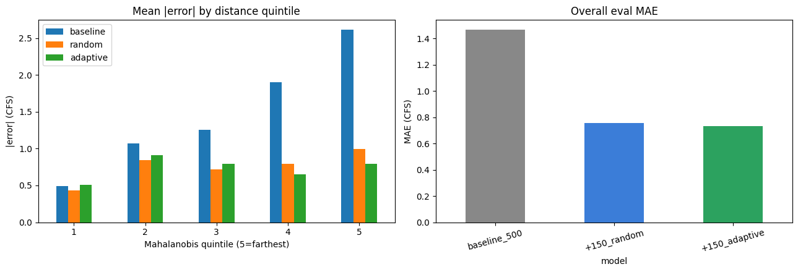

### Decisions in Phase 6

| Decision | Chosen | Alternatives — what they'd change |
|---|---|---|
| Selection signal | AD-distance maximin | *RF variance* = classic active learning, unreliable OOD; *hybrid* = maybe best targeting, two knobs. |
| Evaluation | adaptive vs random, held-out | *adaptive-only* = can't separate guidance from more-data; *learning curve* = full efficiency gap, many runs. |
| Rounds | single batch | *iterative multi-round* = re-target the updated model each round → convergence curve (natural next step). |
| Budget | +150 | smaller = cheaper; larger = closes the gap toward "fully covered." |

---

## Cross-cutting decisions

| Decision | Chosen | Note |
|---|---|---|
| Notebook authoring | generator scripts (`build_phaseN.py` + `nbformat`) | Every notebook is regenerable and diffable; edits go in the builder. |
| Repo layout | `swmm/ notebooks/ scripts/ data/ docs/ runs/` | Reorganized from a flat dir before the first push. |
| Version control | Git + public GitHub (`AiferAifa/swmm-surrogate-modeling`), commit per phase | Public chosen for portfolio/application use. |
| `.gitignore` | ignore `runs/`, `models/`, `*.out`, `mc_results.csv` | Regenerable/bulky; keep small result CSVs tracked. |
| SWMM interface | `runswmm.exe` subprocess | Transparent; the GUI/engine split is what makes automation possible. |

---

## Master Decision Map

Every fork in one place. **Bold = chosen.**

| # | Phase | Decision | Options (chosen in **bold**) |
|---|-------|----------|-------------------------------|
| 1 | 1 | Model source | **rebuild trimmed EPA sample** · download real model |
| 2 | 1 | Units | **US (CFS/ft/in)** · SI |
| 3 | 2 | Session scope | **pipeline + 100 pilot** · sampling only · straight to 500 |
| 4 | 2 | Run + extract | **runswmm.exe + parse .rpt** · swmm-toolkit · pyswmm |
| 5 | 2 | %imperv variation | **per-subcatchment multiplier** · absolute uniform |
| 6 | 2 | Sampling | **LHS uniform** · plain random · maximin/Sobol |
| 7 | 2/3 | Dataset size | 100 · 300 · **500** · learning curve |
| 8 | 3 | Flood target | **2-stage (classify→regress)** · single regressor · peak only |
| 9 | 3 | Validation | **80/20 stratified + 5-fold CV** · single split · nested CV |
| 10 | 3 | Models | **RF vs XGBoost** · + neural net · + Gaussian process |
| 11 | 3 | Tuning | skip · **light RandomizedSearch** · deep Optuna |
| 12 | 4 | MC inputs | **uniform in-range** · realistic priors · wider-than-training |
| 13 | 4 | Flood combine | **hard two-stage** · Bernoulli(p) · prob-weighted |
| 14 | 4 | Sensitivity | perm only · **perm + SHAP** · + Sobol |
| 15 | 5 | Phase scope | AD only · **AD + validate error** · + adaptive |
| 16 | 5 | Probe design | **wide box** · radial shells · held-out mix |
| 17 | 5 | AD metrics | **range + Mahalanobis + kNN** · isolation forest / LOF · GP variance |
| 18 | 6 | Selection | **AD-distance maximin** · RF variance · hybrid |
| 19 | 6 | Evaluation | adaptive only · **adaptive vs random, held-out** · learning curve |
| 20 | 6 | Rounds | **single batch** · iterative multi-round |

### If you want to revisit a fork later

- **#4 (pyswmm):** switch when subprocess overhead dominates (thousands of runs) or you need per-timestep series.
- **#8 (single flood regressor):** try a zero-inflated / two-part model or quantile regression if you want one unified flood model.
- **#10 (Gaussian process surrogate):** gives *built-in* predictive uncertainty — an alternative AD signal that would make Phase 6's uncertainty-based selection (#18) viable.
- **#12 (realistic MC priors):** the single biggest step toward a real-world flood-risk statement — replace uniforms with fitted rainfall/imperviousness distributions.
- **#14 (Sobol):** cheap now that the surrogate is fast; adds variance-based first/total-order indices.
- **#20 (iterative adaptive):** loop Phase 6 (retrain → reselect → repeat) and plot a convergence curve — the strongest version of the active-learning story.

---

## Reproduce everything

```bash
pip install -r requirements.txt          # numpy/pandas/scipy/sklearn/xgboost/shap/jupyterlab
# set SWMM_EXE in each notebook's config cell to your runswmm.exe

# regenerate any notebook from its builder, then run it:
python scripts/build_notebook.py         # Phase 2 (set N_RUNS=500)
python scripts/build_phase3.py           # Phase 3
python scripts/build_phase4.py           # Phase 4  (needs models/ from Phase 3)
python scripts/build_phase5.py           # Phase 5  (needs data/mc_results.csv)
python scripts/build_phase6.py           # Phase 6  (needs data/ad_probes.csv)

# execute a notebook headlessly (writes outputs back in):
jupyter nbconvert --to notebook --execute --inplace notebooks/<name>.ipynb
```

**Run order matters** (each phase consumes the previous phase's artifacts): Phase 2 → `data/dataset.csv`; Phase 3 → `models/*.joblib`; Phase 4 → `data/mc_results.csv`; Phase 5 → `data/ad_probes.csv`; Phase 6 → `data/adaptive_results.csv`.

---

*Generated as the project's decision log — see `docs/superpowers/specs/` for each phase's full design spec, and the notebooks for complete code and live outputs.*
